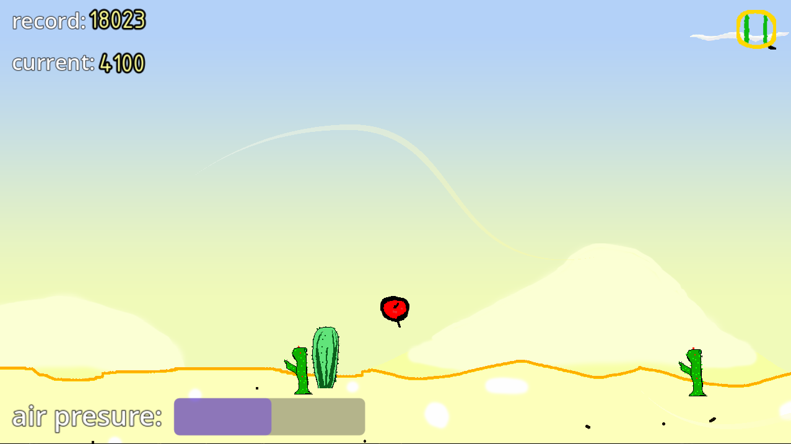
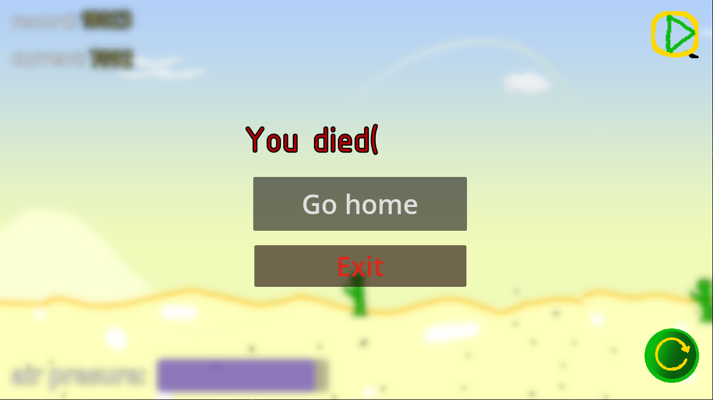

# Sharik_run

  
  

# This is my first full game made in godot.

# To play this game, follow these steps:

    Download the project files.
    Ensure that you have already installed Godot.
    Open "project.godot" using the Godot game engine.
    Run the game.

# Control
You can play using your keyboard or screen.

  KEYBOARD
    Press W or up to up.
    Press S or down to down.
  SCREEN
    Tap above the middle to up
    Tap below the middle to down

If you move down, the air pressure increases.
If you move up, the air pressure decreases.
If the air pressure is low, you will not be able to move up for some time.  
